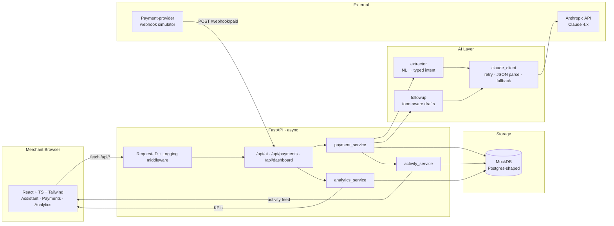

# System Architecture

End-to-end view of how a merchant request becomes a tracked payment.

## Layer responsibilities

| Layer | Owns | Doesn't touch |
|---|---|---|
| **Routes** | HTTP schema, status codes, OpenAPI surface | Business logic, AI |
| **Services** | Domain logic, orchestration, store I/O | HTTP, prompt strings |
| **AI** | Prompt construction, retry, parsing, fallback | Persistence, HTTP |
| **Schemas** | Validation, OpenAPI types | I/O |
| **Database** | Persistence interface | Domain logic |

This separation is what lets us swap MockDB for Postgres, or swap Claude for a multi-agent router, without rewriting the routes or the frontend.
