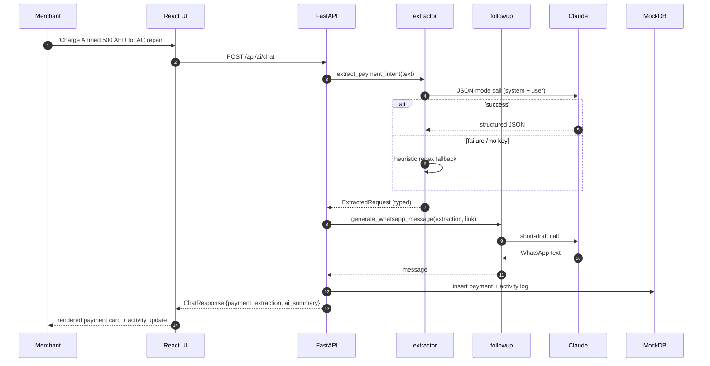
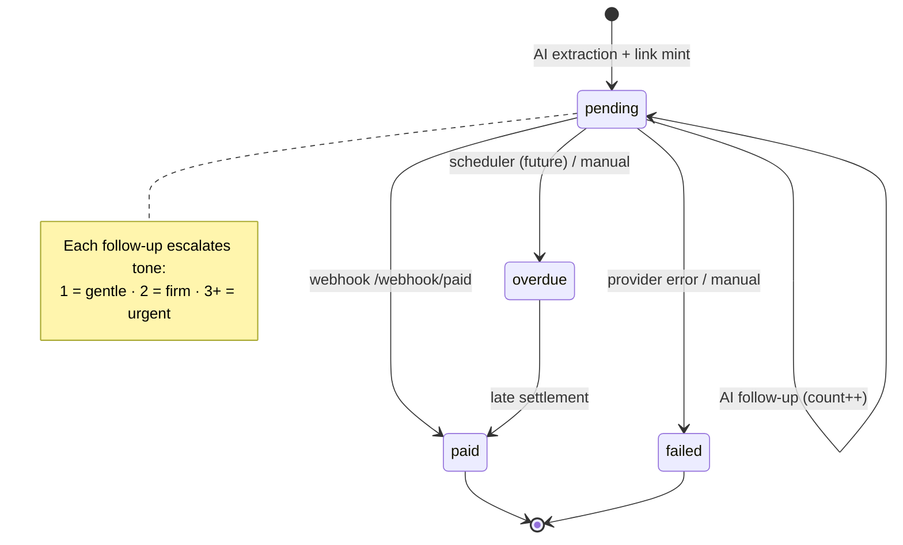
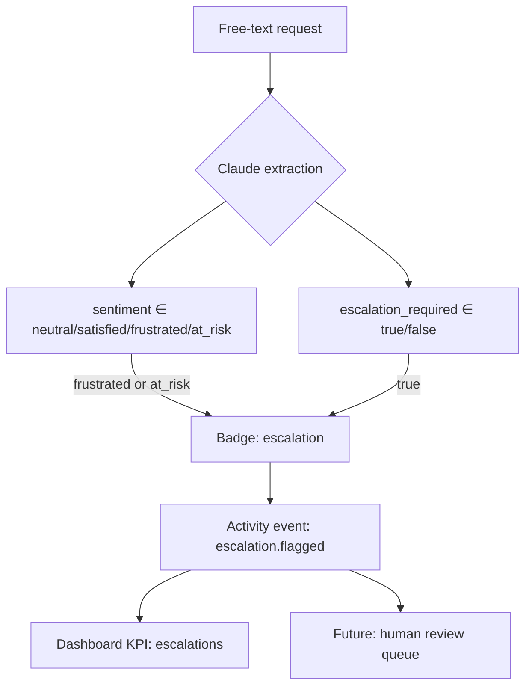

# AI Workflow & Payment Lifecycle

## 1. AI Workflow Orchestration

Key properties:
- **Idempotent fallback** — every AI step has a deterministic backup so the demo never breaks.
- **Retry-safe** — `claude_client` wraps every call with bounded exponential backoff.
- **Auditable** — each step logs an activity event, building a free audit trail.

## 2. Payment Lifecycle

## 3. Escalation Detection

This is the seed of the future risk/dunning multi-agent system — every signal we need is already structured on the payment record.
